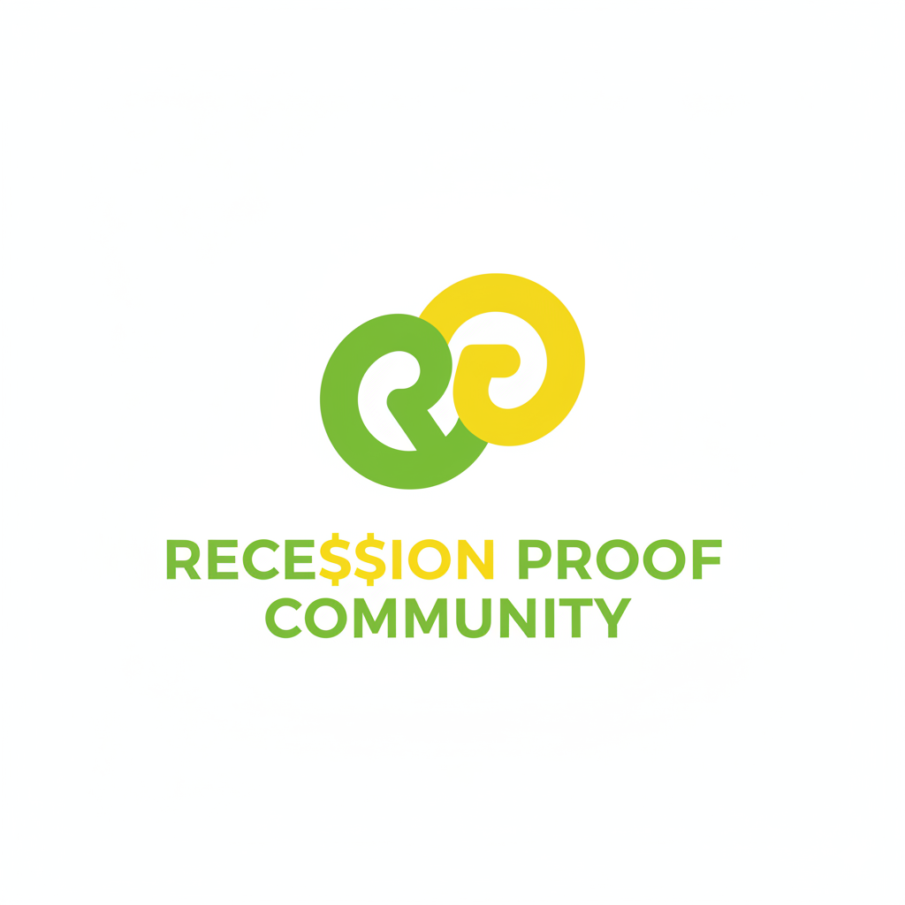

# RPP Auto Mobile App
<div align="center">


**Professional Vehicle Diagnostic & Management Solution**

[](https://expo.dev)
[](https://reactnative.dev)
[](https://expo.dev)
</div>

## Project Overview
RPP Auto is a comprehensive mobile application designed for vehicle diagnostics, maintenance scheduling, and mechanic connection. It features an AI-powered diagnostic wizard, OBD2 scanner integration, and a community forum for automotive enthusiasts.

### Key Features
* **AI Diagnostic Wizard:** Step-by-step symptom analysis.
* **Vehicle Management:** Track maintenance, mileage, and service records.
* **Mechanic Finder:** Geolocation-based service provider directory.
* **Community Forum:** Interact with other users and experts.

---

## Configuration & Build Setup
This project uses **Expo (EAS)** for building and **NPM** for dependency management.

### Prerequisites
* Node.js (LTS)
* NPM (Package Manager)
* Expo CLI (`npm install -g eas-cli`)

### 1. Installation
Clone the repository and install dependencies:
```bash
git clone https://github.com/YOUR_USERNAME/RPP-Auto-Mobile-App.git
cd RPP-Auto-Mobile-App
npm install
```

### 2. Environment Setup
The application requires specific configuration in `app.json` and `eas.json` to handle build types correctly.
* **Source of Truth:** `app.json` handles the project identity.
* **Build Profiles:** `eas.json` manages `development` (APK) and `production` (App Bundle) builds.

### 3. Running the App (Local)
Start the development server:
```bash
npx expo start
```

### 4. Building for Android (Cloud)
To generate a build using EAS:

**Development Build (APK for testing):**
```bash
eas build --platform android --profile development
```

**Production Build (AAB for Play Store):**
```bash
eas build --platform android --profile production
```

---

## Project Structure
```text
RPP-Auto-Mobile-App/
├── assets/       # Critical build assets (Icons, Splash)
├── components/   # Reusable UI components
├── screens/      # Application screens (Diagnostic, Home, etc.)
├── app.json      # Expo Configuration
├── eas.json      # EAS Build Configuration
└── package.json  # Dependencies (NPM)
```

## Contribution
1. Fork the repository
2. Create your feature branch (`git checkout -b feature/AmazingFeature`)
3. Commit your changes (`git commit -m 'Add some AmazingFeature'`)
4. Push to the branch (`git push origin feature/AmazingFeature`)
5. Open a Pull Request

---
*© 2026 RPP Auto. All Rights Reserved.*
